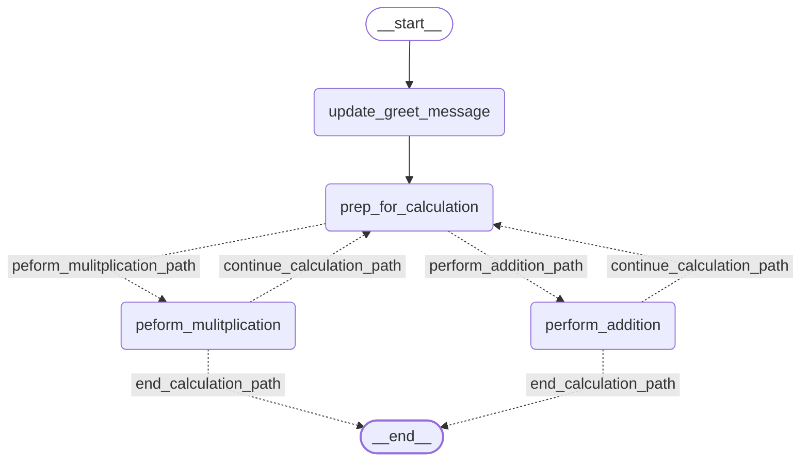

```mermaid
---
config:
  flowchart:
    curve: linear
---
graph TD;
	__start__([<p>__start__</p>]):::first
	update_greet_message(update_greet_message)
	prep_for_calculation(prep_for_calculation)
	peform_mulitplication(peform_mulitplication)
	perform_addition(perform_addition)
	__end__([<p>__end__</p>]):::last
	__start__ --> update_greet_message;
	peform_mulitplication -. &nbsp;end_calculation_path&nbsp; .-> __end__;
	peform_mulitplication -. &nbsp;continue_calculation_path&nbsp; .-> prep_for_calculation;
	perform_addition -. &nbsp;end_calculation_path&nbsp; .-> __end__;
	perform_addition -. &nbsp;continue_calculation_path&nbsp; .-> prep_for_calculation;
	prep_for_calculation -. &nbsp;peform_mulitplication_path&nbsp; .-> peform_mulitplication;
	prep_for_calculation -. &nbsp;perform_addition_path&nbsp; .-> perform_addition;
	update_greet_message --> prep_for_calculation;
	classDef default line-height:1.2
	classDef first fill-opacity:0
	classDef last stroke-width:2px

```
